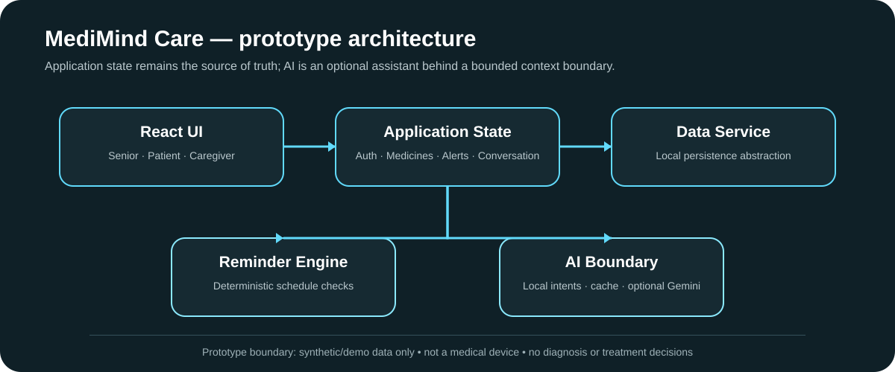

<p align="center">

</p>

<p align="center">
<a href="https://medimind-seven.vercel.app/"></a>


</p>

# MediMind Care

**AI-assisted medication-reminder and health-workflow prototype.**

MediMind explores how one interface can adapt to different users while keeping application state and deterministic workflows separate from an optional AI assistant.

> ⚠️ **Healthcare prototype:** MediMind is for research and education. It is **not a medical device** and must not be used for diagnosis, treatment decisions, emergency response, or medication decisions. Use synthetic/demo data only.

## What it demonstrates

- **Senior mode** — large controls, simplified navigation, voice reminders and SOS access.
- **Patient mode** — medication schedules, adherence information and AI assistance.
- **Caregiver mode** — multi-patient cards, alerts and adherence views.
- **Deterministic reminders** — schedule checking stays outside the model.
- **AI boundary** — bounded context, local intent handling and optional Gemini integration.
- **Local persistence** — application storage is abstracted behind a data service.

## Architecture

The repository keeps the AI layer away from direct storage access. Common requests can be handled locally, while optional model calls receive bounded application context.

```text
React UI
   ↓
Application State
   ├── Data Service → local persistence
   ├── Reminder Engine → deterministic checks
   └── AI Boundary
         ├── local intents
         ├── response cache
         ├── context builder
         └── optional Gemini
```

## Core features

| Area | Prototype capability |
|---|---|
| Medication | schedules, intake logging, missed-dose state |
| Reminders | periodic schedule checks and alerts |
| Adherence | history, streaks and weekly visualization |
| AI assistant | Gemini path with local fallback/cache |
| Voice | browser speech recognition + text-to-speech |
| Accessibility | senior-oriented controls and typography |
| Caregiver | patient cards, alerts and detail views |
| Storage | localStorage behind `DataService` |
| Hardware concept | simulated dispenser view |
| Language | English + Malayalam preference paths |

## Quick start

```bash
npm ci
npm run dev
```

Open the local Vite URL shown in the terminal.

### Demo accounts

| User | PIN | Mode |
|---|---:|---|
| Arjun Nair | `1234` | Standard patient |
| Leela Menon | `0000` | Senior citizen |
| Priya Nair | `9999` | Caregiver |

These are demo credentials for the prototype. Do not use real credentials.

## AI configuration

Development should use the local/mock path by default.

```bash
cp .env.example .env.development
```

For live Gemini experimentation, configure the Vite environment variables locally. **Never commit an API key or real medical data.**

## Validation

```bash
npm ci
npm run build
```

GitHub Actions validates the production build on pushes and pull requests to `main`.

## Repository structure

```text
src/
├── components/       # reusable UI components
├── contexts/         # application state
├── hooks/            # React integration hooks
├── screens/          # role-specific and shared screens
├── services/         # storage, reminders and AI services
└── utils/            # helpers and demo seed data

docs/                 # architecture documentation
.github/              # CI workflow
```

## Design principles

1. **AI is an assistant, not the source of truth.**
2. **Application state stays outside the model.**
3. **Deterministic intents should not require an API call.**
4. **Clinical claims must never be presented as authoritative medical advice.**
5. **Accessibility should not depend on color alone.**
6. **Persistence should be replaceable without rewriting the UI.**

## Roadmap

- [x] Three role-oriented interfaces
- [x] Medication/reminder state model
- [x] Local fallback and response cache
- [x] Gemini integration path
- [x] Accessibility-focused senior mode
- [x] Production build validation in CI
- [x] Safe environment template
- [ ] Browser-level regression suite
- [ ] Stronger reminder/adherence unit coverage
- [ ] Explicit backend/privacy architecture before real user data
- [ ] Formal threat model

## Contributing & security

See [`CONTRIBUTING.md`](CONTRIBUTING.md) and [`SECURITY.md`](SECURITY.md). Keep changes focused, use synthetic data, and preserve the healthcare prototype boundary.

## Links

- **[Live demo](https://medimind-seven.vercel.app/)**
- **[Repository](https://github.com/aspire488/medimind)**

## License

See [`LICENSE`](LICENSE).

<p align="center"><sub>Built as a healthcare UX, systems, and AI-boundary prototype — not for clinical use.</sub></p>
